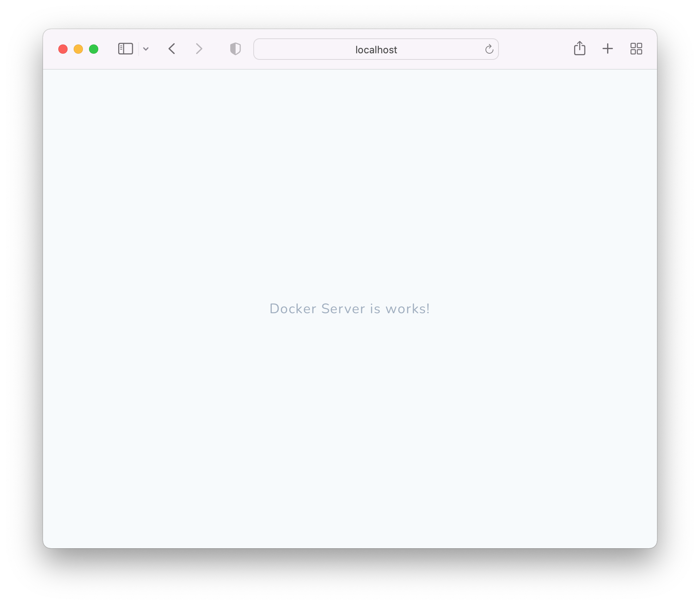

# docker-server

Before you start working with the server, you must install: **docker**, **ansible**, **make**.

After starting the server, it can be seen at `http://localhost/`, display the contents of the file `./www/index.php`.

> To configure the server, you need to configure the file `./config.yml` and run the command `make local-start`.

## Characteristics

* php: `7.2`, `7.4`, `8.0`;
* workspace;
* mysql;
* nginx;
* redis;
* maildev;
* beanstalkd;
* supervisor;
* laravel horizon.

## Server structure

* `.data` - data stored on the main OC and connected to the container;
* `ansible` - configuration files;
* `service` - connected services;
* `temp` - generated files at server started;
    * `logs` - service logs;
* `www` - server root folder.

## Useful links

* [localhost:80](http://localhost/);
* [maildev:1080](http://localhost:1080/).

## Control commands

* [Server](.docs/server/server.md);
* [Server settings](.docs/server/server-settings.md);
* [Something not work, look here](.docs/server/server-hack.md).
